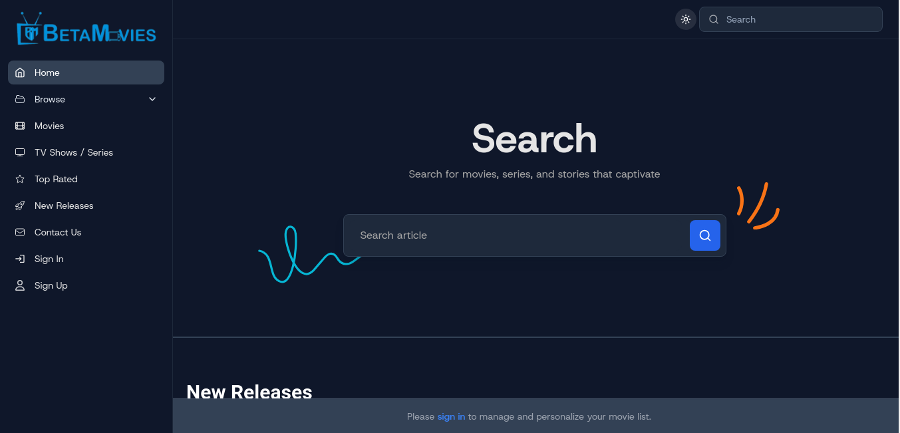
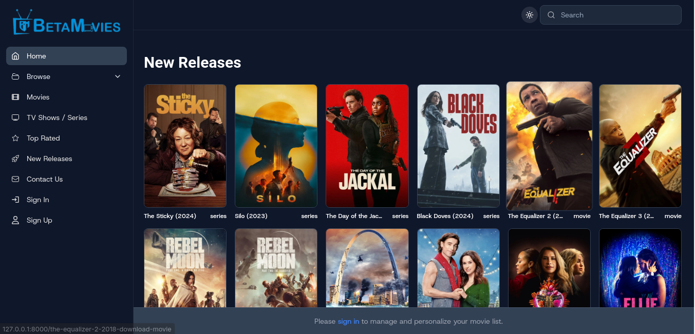
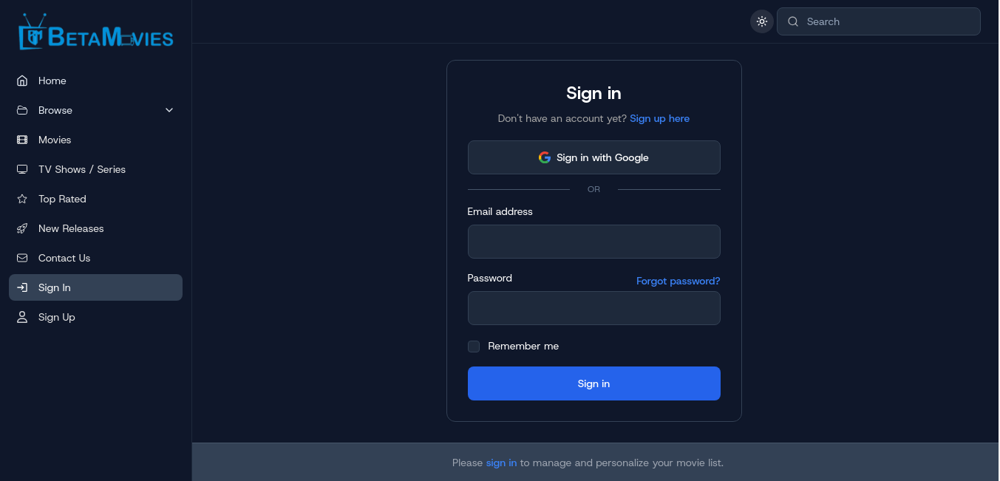
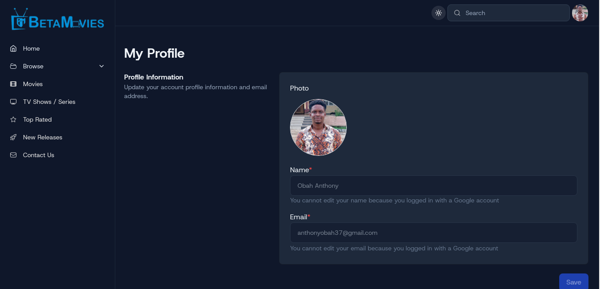
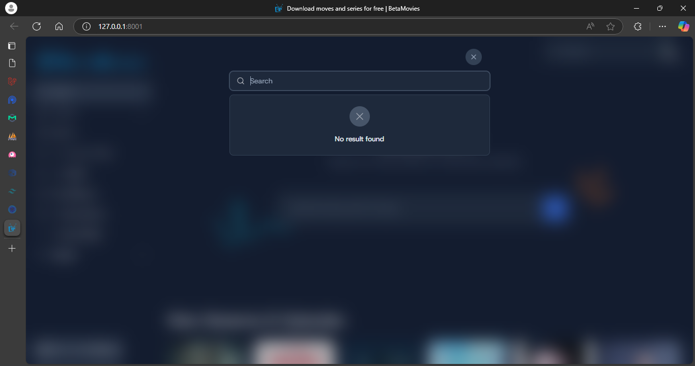

<p align="center"><a href="https://laravel.com" target="_blank"></a></p>

<h4 align="center">📱 Contact & 👨 Social</h4>
<p align="center">
<!-- <a href="https://github.com/laravel/framework/actions"></a>
<a href="https://packagist.org/packages/laravel/framework"></a>
<a href="https://packagist.org/packages/laravel/framework"></a>
<a href="https://packagist.org/packages/laravel/framework"></a> -->
<a href="mailto:anthonyobah37@gmail.com"></a>
<a href="https://github.com/obahchimaobi"></a>
<a href="https://linkedin.com/in/obahchimaobi"></a>
</p>

<h4 align="center">🚀 Skills</h4>
<p align="center">
<a href=""></a>
<a href=""></a>
<a href=""></a>
<a href=""></a>
<a href=""></a>
<a href=""></a>
<a href=""></a>
<a href=""></a>
<a href=""></a>
</p>

<h4 align="center">💻 OS</h4>
<p align="center">
<a href=""></a>
<a href=""></a>
<a href=""></a>
<a href=""></a>
<a href=""></a>
<a href=""></a>
</p>


# BetaMovies Documentation

**BetaMovies** is a comprehensive movie streaming platform that allows users to browse, view, and interact with a wide range of movies and series. This documentation provides detailed information about the platform's features, structure, and how developers can contribute or enhance the system.







---

## **Table of Contents**
1. [Project Overview](#project-overview)
2. [Features](#features)
3. [Installation](#installation)
4. [System Architecture](#system-architecture)
5. [API Integrations](#api-integrations)
6. [Key Components](#key-components)
7. [Authentication and Security](#authentication-and-security)
8. [Admin Panel](#admin-panel)
9. [User Interface](#user-interface)
10. [Customization](#customization)
11. [Troubleshooting and Support](#troubleshooting-and-support)

---

## **Project Overview**
BetaMovies is designed to provide an interactive movie and series streaming experience. The platform fetches data from [The Movie Database (TMDb) API](https://www.themoviedb.org/documentation/api) to offer the latest information about movies, series, and genres.

The revamped version includes performance optimizations, a cleaner UI, and enhanced features such as better search functionality, dynamic genre filtering, and improved responsiveness.

---

## **Features**
- **Movie Search:** Users can search movies by name, genre, release year, or other parameters.
- **Dynamic Genres:** Genres are dynamically fetched and displayed in a navigation bar.
- **Responsive Design:** Fully responsive interface optimized for mobile and desktop.
- **TMDb Integration:** Fetch movies, series, and seasons dynamically via the TMDb API.
- **Trailer Support:** Watch trailers directly from the movie details page.
- **Admin Panel:** Manage movies, genres, and user interactions from an easy-to-use backend.
- **Dark/Light Mode:** Supports user preferences for theme selection.
- **Authentication Features:** Secure login, email verification, and Google authentication.

---

## **Installation**

### Prerequisites:
1. PHP >= 8.1
2. Composer
3. Laravel >= 11x
4. Node.js & NPM
5. MySQL or any supported relational database
6. A TMDb API key

### Steps:
1. Clone the repository:
   ```bash
   git clone https://github.com/obahchimaobi/betamovies.git
   cd betamovies
   ```
2. Install dependencies:
   ```bash
   composer install
   npm install && npm run dev
   ```
3. Configure `.env` file:
   ```env
   APP_NAME=BetaMovies
   APP_URL=http://localhost
   DB_CONNECTION=mysql
   DB_HOST=127.0.0.1
   DB_PORT=3306
   DB_DATABASE=betamovies
   DB_USERNAME=root
   DB_PASSWORD=secret
   TMDB_API_KEY=your_tmdb_api_key
   GOOGLE_CLIENT_ID=your_google_client_id
   GOOGLE_CLIENT_SECRET=your_google_client_secret
   GOOGLE_REDIRECT_URI="http://127.0.0.1:8000/auth/google/callback"
   ```
4. Migrate and seed the database:
   ```bash
   php artisan migrate --seed
   ```
5. Serve the application:
   ```bash
   php artisan serve
   ```

---

## **System Architecture**

### Backend
- **Framework:** Laravel 11x
- **Database:** MySQL
- **APIs:** TMDb API, custom APIs for user and movie management
- **Storage:** Local filesystem or cloud-based solutions (e.g., AWS S3)

### Frontend
- **Framework:** Blade Templates (Laravel Livewire)
- **Styling:** TailwindCSS with additional custom CSS
- **Responsiveness:** Built with a mobile-first approach

---

## **API Integrations**
### TMDb API
- **Usage:** Fetch movie details, genres, seasons, and episode information.
- **Endpoints Used:**
  - `/movie/{id}`: Fetches movie details.
  - `/genre/movie/list`: Fetches list of genres.
  - `/tv/{id}/season/{season_number}`: Fetches season and episode details.

### Custom Endpoints
- `/api/movies`: Fetch movies stored in the database.
- `/api/users`: Manage user data.

---

## **Key Components**

### Movie Display Section
Optimized for smooth scrolling and fast rendering:
- Uses `background-fixed` efficiently.
- Images are preloaded and compressed into WebP format.
- Lazy loading implemented for large assets.

### Search Functionality
- Searches by title and release year.
- Returns related results when exact matches aren’t found.
- Optimized SQL queries to improve performance.

### Theme Management
- Detects user preference for light or dark mode.
- Uses Tailwind's `dark:` classes for seamless theme transitions.

---

## **Authentication and Security**

### Authentication Features
- **Secure Login:** Users can register and log in with strong password requirements and hashed storage.
- **Email Verification:** New users receive a verification email to confirm their account.
- **Google Authentication:** Users can log in using their Google accounts for faster access.

### Security Measures
- **CSRF Protection:** Implemented to protect against cross-site request forgery.
- **Password Reset:** Secure password reset functionality via email.
- **Role-Based Access:** Ensures only authorized users can access specific parts of the platform.

---

## **Admin Panel**
The admin panel includes:
- **Movie Management:** Add, update, and delete movies.
- **User Management:** View and manage users.
- **IP Restriction:** Restrict access to the admin panel to specific IP addresses.
- **Logs:** View activity logs for better monitoring.
- **Framework:** The admin panel will be implemented using FilamentPHP.

---

## **User Interface**
- **Home Page:** Displays featured and trending movies.
- **Details Page:** Provides comprehensive information about a selected movie or series.
- **Responsive Design:** Adapts to different screen sizes and orientations.

---

## **Customization**
Developers can customize the platform by:
1. Updating the `resources/views` folder for UI changes.
2. Modifying controllers in `app/Http/Controllers` for backend logic.
3. Adding new routes in `routes/web.php` or `routes/api.php`.

---

## **Troubleshooting and Support**

### Common Issues:
1. **Slow Scrolling on Background Sections:**
   - Ensure all images are optimized.
   - Use `background-attachment: scroll` as a fallback for older devices.

2. **Database Errors:**
   - Verify `.env` database credentials.
   - Run migrations using `php artisan migrate`.

3. **API Errors:**
   - Confirm TMDb API key validity.
   - Check rate limits on the TMDb account.

### Support:
- Contact: support@betamovies.com
- Documentation updates: [GitHub Wiki](https://github.com/obahcimaobi/betamovies/wiki)
